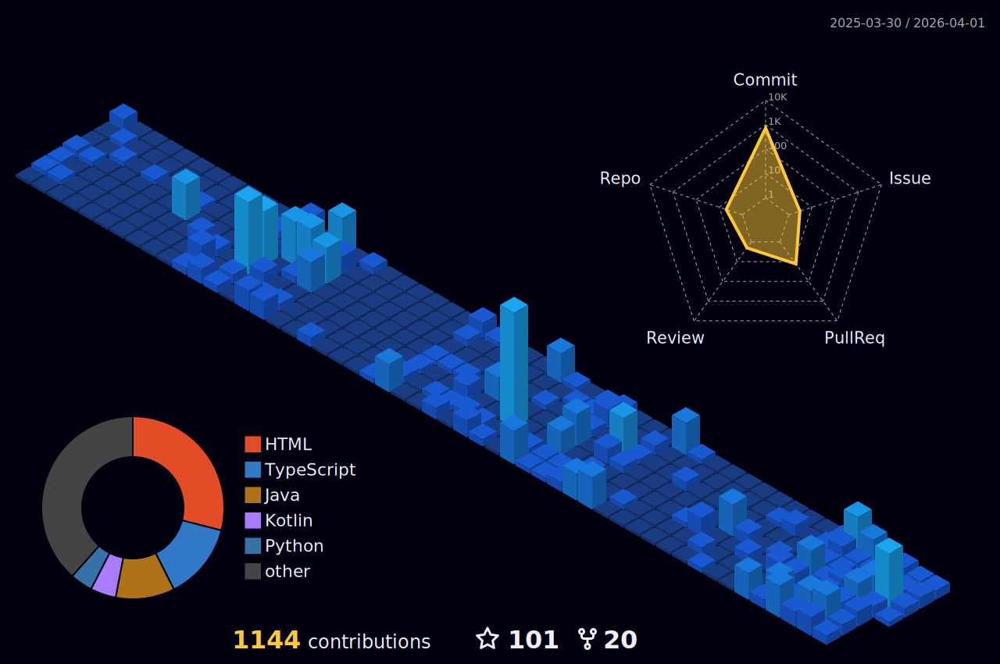

<!-- Dynamic Header with Dark Blue Colors -->

  

<!-- Live Typing Animation -->

  

<!-- Profile Analytics Dashboard with Dark Blue Style -->

  
  
  
  

---

<!-- Bio Section with Gradient -->

  
  <h2>🚀 About Me</h2>
  

    <em>Passionate developer from <strong>Ariana, Tunisia</strong> 🇹🇳</em> 
    <em>Turning ideas into reality through code and innovation</em> 
    <em>Building bridges between technology and human needs</em>
  

---

<!-- GITHUB ACTIONS WIDGET 2: 3D Contribution Calendar -->
<!-- SETUP: Add .github/workflows/profile-3d.yml — see instructions below README -->
<h2 align="center">🌐 3D Contribution Calendar</h2>

  

---
<!-- Comprehensive Tech Stack -->
<h2 align="center">💻 Complete Technology Arsenal</h2>

  <h3>🔥 Core Programming Languages</h3>
  
  
  <h3>⚡ Frameworks & Libraries</h3>
  
  
  <h3>🗄️ Databases & Cloud</h3>
  
  
  <h3>🛠️ Development Tools</h3>
  
  
  <h3>🏗️ DevOps & Infrastructure</h3>
  
  
  <h3>🔧 Additional Technologies</h3>
  
  
  <h3>🔐 Security & Monitoring Tools</h3>
  
  
  
  
  
  
  
  
  
  

---

<!-- GITHUB ACTIONS WIDGET 4: Recent Activity -->
<!-- SETUP: Add .github/workflows/activity.yml -->
<h2 align="center">⚡ Recent GitHub Activity</h2>

<!--START_SECTION:activity-->
1. 🔒 Closed issue [#31](https://github.com/aliammari1/aliammari1/issues/31) in [aliammari1/aliammari1](https://github.com/aliammari1/aliammari1)
2. 🔒 Closed issue [#31](https://github.com/aliammari1/aliammari1/issues/31) in [aliammari1/aliammari1](https://github.com/aliammari1/aliammari1)
3. 🔒 Closed issue [#27](https://github.com/aliammari1/aliammari1/issues/27) in [aliammari1/aliammari1](https://github.com/aliammari1/aliammari1)
4. 🔒 Closed issue [#20](https://github.com/aliammari1/aliammari1/issues/20) in [aliammari1/aliammari1](https://github.com/aliammari1/aliammari1)
5. 🔒 Closed issue [#18](https://github.com/aliammari1/aliammari1/issues/18) in [aliammari1/aliammari1](https://github.com/aliammari1/aliammari1)
6. 🔒 Closed issue [#14](https://github.com/aliammari1/aliammari1/issues/14) in [aliammari1/aliammari1](https://github.com/aliammari1/aliammari1)
7. 🔒 Closed issue [#2](https://github.com/aliammari1/aliammari1/issues/2) in [aliammari1/aliammari1](https://github.com/aliammari1/aliammari1)
8. 🎉 Merged PR [#8](https://github.com/aliammari1/QtVoyager/pull/8) in [aliammari1/QtVoyager](https://github.com/aliammari1/QtVoyager)
<!--END_SECTION:activity-->
---

<!-- Advanced Stats Grid -->
<h2 align="center">📊 Advanced Developer Metrics</h2>

  <table>
    <tr>
      <td>
        
      </td>
      <td>
        
      </td>
    </tr>
    <tr>
      <td>
        
      </td>
      <td>
        
      </td>
    </tr>
  </table>

---

<!-- GITHUB ACTIONS WIDGET 1: Contribution Snake -->
<!-- SETUP: Add .github/workflows/snake.yml — see instructions below README -->
<h2 align="center">🐍 Contribution Snake</h2>

  <picture>
    <source media="(prefers-color-scheme: dark)"
      srcset="https://raw.githubusercontent.com/aliammari1/aliammari1/output/github-snake-dark.svg" />
    <source media="(prefers-color-scheme: light)"
      srcset="https://raw.githubusercontent.com/aliammari1/aliammari1/output/github-snake.svg" />
    
  </picture>

---

<!-- Contact & Social Links -->
<h2 align="center">🌐 Connect & Collaborate</h2>

  
  
  
  

---

<!-- Footer with Dark Blue Colors -->

  
  
  

    <em>"Code is poetry written in logic, and every commit is a verse in the story of innovation."</em>
  

  
  
  
  

