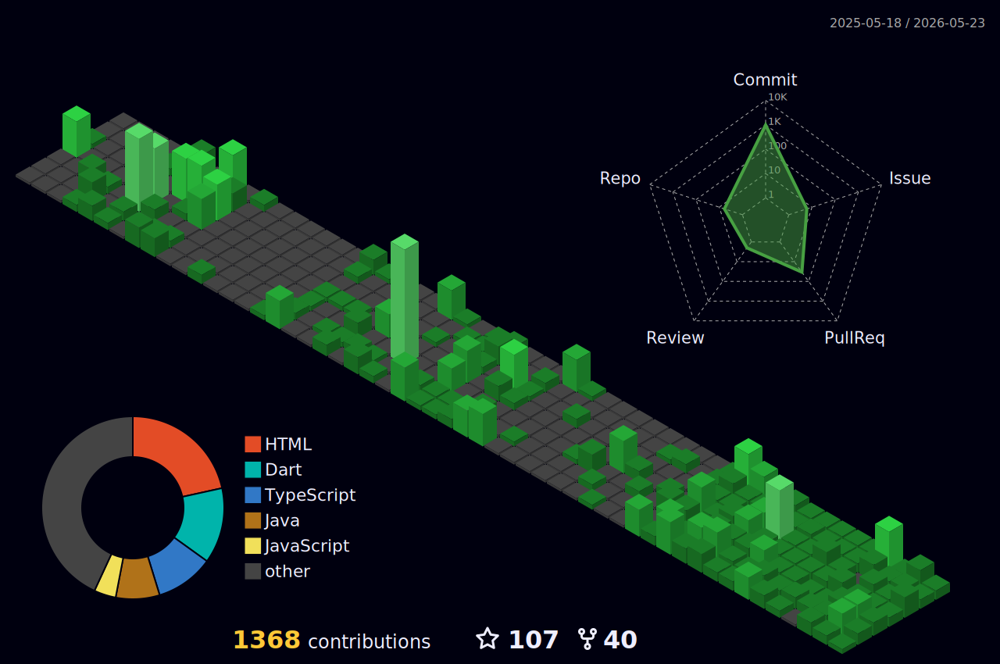

<!-- Banner: charcoal editorial hero.
     TODO: generate assets/hero.png (1280x320, see BANNER.md) and swap the
     capsule-render placeholder below for the committed local asset:
        -->

  

<!-- Live Typing Animation -->

  

---

<!-- Bio Section -->

  <h2>Hi, I'm Ali Ammari</h2>
  

    Full-Stack Developer · Mobile Developer · AI Application Builder 
    Based in Tunisia — available for remote work worldwide
  

  <table>
    <tr>
      <td>🛠️ <strong>What I build</strong></td>
      <td>Web apps, mobile apps (iOS &amp; Android), and AI-powered products — end to end</td>
    </tr>
    <tr>
      <td>⚡ <strong>My stack</strong></td>
      <td>TypeScript · React · Next.js · NestJS · Flutter · Python · Java</td>
    </tr>
    <tr>
      <td>💼 <strong>Availability</strong></td>
      <td>Open to freelance projects, contracts, and full-time roles</td>
    </tr>
  </table>

---

<!-- Featured Projects. The blurbs between the markers below are kept current by
     .github/workflows/featured-projects.yml (gated on ANTHROPIC_API_KEY); the
     static text committed here is the fallback when the key is absent. -->
<h2 align="center">⭐ Featured Projects</h2>

<!-- FEATURED-PROJECTS:START -->

- **[awesome-ai-tools](https://github.com/aliammari1/awesome-ai-tools)** — Curated, multilingual awesome-list of AI tools with a deployed Astro site.
- **[JobPrep](https://github.com/aliammari1/JobPrep)** — Multi-provider AI career app: CV builder, mock interviews, and a coding arena.
- **[games](https://github.com/aliammari1/games)** — Browser games monorepo: canvas snake and an unbeatable-AI Tic-Tac-Toe.
- **[github-traffic-analytics](https://github.com/aliammari1/github-traffic-analytics)** — Next.js dashboard that persists GitHub traffic past the 14-day window.
- **[pulmocare](https://github.com/aliammari1/pulmocare)** — Chest-imaging clinical platform built on a MedRAX LangGraph agent mesh.
- **[rakcha](https://github.com/aliammari1/rakcha)** — Polyglot cinema platform: JavaFX desktop, Symfony/Twig web, and Flutter mobile.

<!-- FEATURED-PROJECTS:END -->

---

<!-- 3D Contribution Calendar -->
<h2 align="center">🌐 3D Contribution Calendar</h2>

  

---

<!-- Developer Metrics -->
<h2 align="center">📊 Developer Metrics</h2>

  <table>
    <tr>
      <td>
        
      </td>
      <td>
        
      </td>
    </tr>
    <tr>
      <td>
        
      </td>
      <td>
        
      </td>
    </tr>
  </table>

---

<!-- Contribution Snake -->
<h2 align="center">🐍 Contribution Snake</h2>

  

---

<!-- Contact & Social Links -->
<h2 align="center">🌐 Connect &amp; Collaborate</h2>

  
  
  
  

