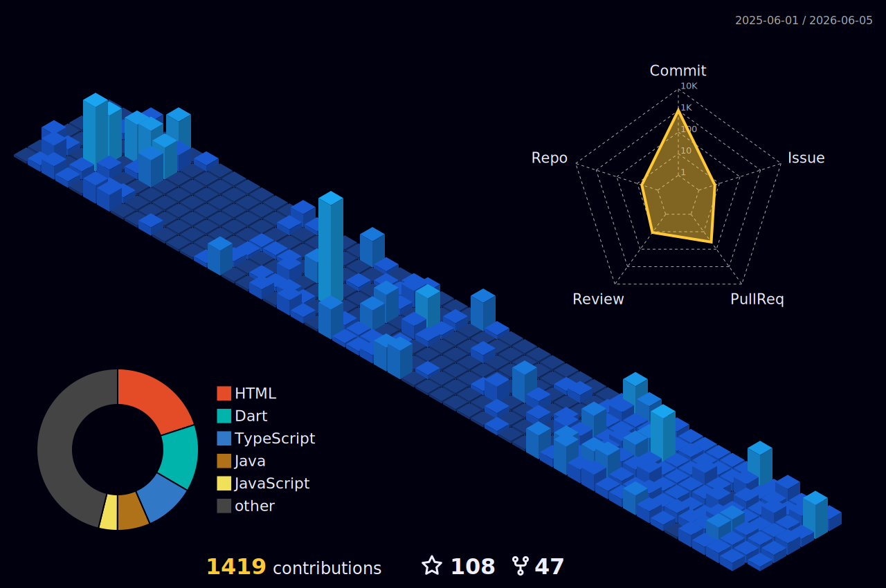

<!-- Dynamic Header with Charcoal Colors -->

  

<!-- Live Typing Animation -->

  

<!-- Profile Analytics Dashboard with Charcoal Style -->

  
  
  
  

---

<!-- Bio Section -->
<!-- Bio Section -->

  <h2>👋 Hi, I'm Ali Ammari</h2>
  

    Full-Stack Developer · Mobile Developer · AI Application Builder 
    Based in <strong>Tunisia</strong> 🇹🇳 — available for remote work worldwide
  

  <table>
    <tr>
      <td>🛠️ <strong>What I build</strong></td>
      <td>Web apps, mobile apps (iOS & Android), and AI-powered products — end to end</td>
    </tr>
    <tr>
      <td>⚡ <strong>My stack</strong></td>
      <td>TypeScript · React · Next.js · NestJS · Flutter · Python · Go</td>
    </tr>
    <tr>
      <td>🌍 <strong>Open source</strong></td>
      <td>20+ public repos — clean code, real projects, actively maintained</td>
    </tr>
    <tr>
      <td>💼 <strong>Availability</strong></td>
      <td>Open to freelance projects, contracts, and full-time roles</td>
    </tr>
  </table>

---

<!-- GITHUB ACTIONS WIDGET 2: 3D Contribution Calendar -->
<h2 align="center">🌐 3D Contribution Calendar</h2>

  

---

<!-- Comprehensive Tech Stack -->
<h2 align="center">💻 Complete Technology Arsenal</h2>

  <h3>🔥 Core Programming Languages</h3>
  
  
  <h3>⚡ Frameworks & Libraries</h3>
  
  
  <h3>🗄️ Databases & Cloud</h3>
  
  
  <h3>🛠️ Development Tools</h3>
  
  
  <h3>🏗️ DevOps & Infrastructure</h3>
  
  
  <h3>🔧 Additional Technologies</h3>
  
  
  <h3>🔐 Security & Monitoring Tools</h3>
  
  
  
  
  
  
  
  
  
  

---

<!-- Advanced Stats Grid -->
<h2 align="center">📊 Advanced Developer Metrics</h2>

  <table>
    <tr>
      <td>
        
      </td>
      <td>
        
      </td>
    </tr>
    <tr>
      <td>
        
      </td>
      <td>
        
      </td>
    </tr>
  </table>

---

<!-- GITHUB ACTIONS WIDGET 1: Contribution Snake -->
<h2 align="center">🐍 Contribution Snake</h2>

  <picture>
    <source media="(prefers-color-scheme: dark)"
      srcset="https://raw.githubusercontent.com/aliammari1/aliammari1/main/assets/snake.svg" />
    <source media="(prefers-color-scheme: light)"
      srcset="https://raw.githubusercontent.com/aliammari1/aliammari1/main/assets/snake.svg" />
    
  </picture>

---

<!-- Contact & Social Links -->
<h2 align="center">🌐 Connect & Collaborate</h2>

  
  
  
  

---

<!-- Footer with Charcoal Colors -->

  
  
  

    <em>"Code is poetry written in logic, and every commit is a verse in the story of innovation."</em>
  

  
  
  
  

